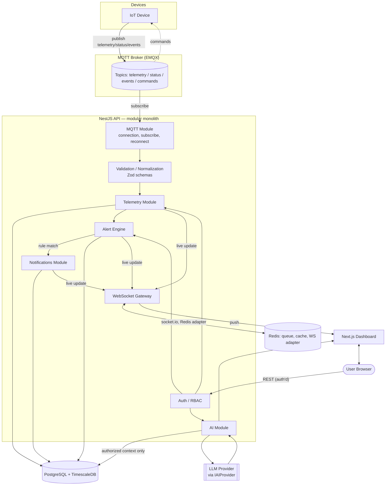

# iot-ai-platform — Architecture & Roadmap

Status: **proposal — pre-implementation**. This document is the output of the architecture
phase requested before any code is written. It covers stack selection, folder structure,
data flow, schema, API/MQTT/WebSocket contracts, security, AI design, testing, deployment,
and a phased roadmap.

---

## 1. Technology Stack

| Concern | Choice | Why |
|---|---|---|
| Language | TypeScript everywhere | One type system across API, web, and shared schemas; fewer integration bugs at the MQTT/WS/REST boundaries. |
| Backend framework | **NestJS** (Node 20 LTS) | Gives us DI, decorators, guards/pipes/interceptors, and — critically — a first-class module system. Modules (`devices`, `telemetry`, `alerts`, `ai`, …) map directly to the "modular monolith with clear extraction boundaries" requirement. Its microservices/transport layer (MQTT, Redis) means a module can later be pulled into its own service with minimal rewrite. |
| Frontend framework | **Next.js (App Router)** + React + TypeScript | SSR for the dashboard shell, file-based routing, good data-fetching story, huge ecosystem for charts/UI. |
| UI kit | Tailwind CSS + shadcn/ui | Accessible primitives out of the box, fast to build a dashboard with loading/empty/error states consistently. |
| Primary database | **PostgreSQL 16** | Relational integrity for users/devices/alerts; mature, boring, well understood. |
| Time-series storage | **TimescaleDB extension on the same Postgres instance** | See §4a. Avoids running a second database technology while still handling telemetry volume properly (hypertables, continuous aggregates, retention/compression policies). |
| ORM / migrations | **Prisma** | Strong TypeScript DX and migration tooling for the relational schema. Timescale-specific DDL (hypertables, continuous aggregates, compression policies) is added via raw-SQL migrations, which Prisma supports natively. |
| Cache / queue / pub-sub | **Redis** | Backs BullMQ (background jobs: alert evaluation, notification dispatch, retention jobs), the Socket.IO adapter (multi-instance WS fan-out), and rate limiting. |
| Background jobs | **BullMQ** | Alert rule evaluation, notification delivery, AI request processing, scheduled telemetry retention/aggregation. |
| MQTT broker | **EMQX** (Mosquitto acceptable for local-only dev) | Open-source, MQTT 5, clustering story for later scale, and — the deciding factor — pluggable HTTP auth/ACL hooks so we can authenticate/authorize each device against our own `device_credentials` table instead of a static broker config. |
| MQTT client (backend) | `mqtt.js`, wrapped behind an `IMqttClient` interface | Keeps the broker/library swappable and gives us one place to handle reconnect/backoff logic. |
| Real-time transport (browser) | **Socket.IO** | Reconnection, rooms (per org/device), and a drop-in Redis adapter for horizontal scaling — all things we'd otherwise hand-roll on top of raw `ws`. |
| Auth | JWT (short-lived access + rotating refresh token), **argon2id** password hashing | Argon2id is the current recommended hashing algorithm (memory-hard, GPU-resistant). Refresh tokens stored hashed, rotated on use, revocable. |
| Validation | `class-validator`/`class-transformer` for HTTP DTOs (NestJS-idiomatic), **Zod** for MQTT payloads and shared FE/BE schemas | Device payloads aren't DTOs going through Nest's pipe system — Zod gives cheap runtime parsing for arbitrary/untrusted JSON off the wire. |
| AI integration | Provider-agnostic `IAIProvider` interface; default adapter = Anthropic Claude API | Keeps the app from being welded to one vendor (explicit requirement). Adapter pattern + factory selected by `AI_PROVIDER` env var. |
| BLE | `IBleAdapter` interface + `MockBleAdapter` | Cloud servers have no BLE radio; see §10. |
| Monorepo tooling | **pnpm workspaces + Turborepo** | Shared types/schemas between `api` and `web` without publishing packages; incremental/cached builds. |
| Testing | Jest + Supertest (backend), Vitest/RTL (frontend), Playwright (E2E), Testcontainers or docker-compose (integration) | See §11. |
| CI/CD | GitHub Actions | Lint/typecheck/test/build on PRs; build+push+deploy on main. |
| Containerization | Docker, multi-stage builds, Docker Compose for local dev | Cloud-agnostic; runs on ECS/Fargate, Cloud Run, AKS, etc. without change. |

**Rejected/deferred alternatives worth naming:**
- *Microservices from day one* — explicitly against the brief; NestJS's module boundaries give us the extraction seam without the operational cost now.
- *InfluxDB / dedicated TSDB* — would mean running and learning a second database system before we've proven we need it. Revisit only if ingestion volume outgrows Timescale (see §4a).
- *Firebase/Supabase realtime* — convenient but couples the architecture to a vendor for the single most important data path (telemetry). MQTT + Socket.IO keeps that path ours and portable.
- *GraphQL* — REST is simpler to reason about for this domain (mostly CRUD + time-range queries) and pairs more naturally with MQTT/WS event design; not ruled out later for the AI/analytics surface if needed.

---

## 2. Monorepo / Folder Structure

```
iot-ai-platform/
├─ apps/
│  ├─ api/                        # NestJS backend (modular monolith)
│  │  ├─ src/
│  │  │  ├─ modules/
│  │  │  │  ├─ auth/
│  │  │  │  ├─ users/
│  │  │  │  ├─ devices/
│  │  │  │  ├─ mqtt/               # connection abstraction, ingestion pipeline
│  │  │  │  ├─ telemetry/
│  │  │  │  ├─ alerts/
│  │  │  │  ├─ notifications/
│  │  │  │  ├─ analytics/
│  │  │  │  ├─ ai/
│  │  │  │  ├─ ble/                # interface + mock adapter only
│  │  │  │  ├─ websocket/          # Socket.IO gateway
│  │  │  │  └─ audit/
│  │  │  ├─ common/                # guards, interceptors, filters, decorators, pipes
│  │  │  ├─ config/                 # typed env config (validated at boot)
│  │  │  ├─ database/               # Prisma schema + raw-SQL Timescale migrations
│  │  │  └─ main.ts
│  │  └─ test/
│  └─ web/                         # Next.js dashboard
│     └─ src/
│        ├─ app/                    # routes: overview, devices, telemetry, alerts, ai, settings
│        ├─ components/
│        ├─ features/               # feature-sliced: devices/, alerts/, ai/, analytics/
│        ├─ hooks/
│        ├─ lib/                    # api client, socket client
│        └─ stores/
├─ packages/
│  ├─ shared-types/                 # DTOs, enums, Zod schemas shared FE/BE and for MQTT payloads
│  └─ config/                       # base eslint/tsconfig/prettier
├─ infra/
│  ├─ docker/                       # Dockerfiles (api, web)
│  └─ docker-compose.yml            # postgres+timescale, redis, emqx, api, web
├─ docs/
│  └─ ARCHITECTURE.md               # this file
├─ .github/workflows/
├─ turbo.json
├─ pnpm-workspace.yaml
└─ .env.example
```

Future extraction targets (if/when needed): `mqtt`/`telemetry` → ingestion service; `ai` → AI gateway service; a new `apps/edge-agent` for real BLE/CV hardware integration. The module boundaries above are drawn specifically so those extractions don't require redesign.

---

## 3. Architecture Diagram



---

## 4. Database Schema

### 4a. PostgreSQL vs PostgreSQL+TimescaleDB vs a dedicated TSDB

**Decision: PostgreSQL 16 + TimescaleDB extension, single database.**

- Telemetry needs to be joined against relational data constantly (device → org, device → alert rules, telemetry → device metadata for dashboards). Keeping it in the same engine as the relational data avoids cross-database joins/duplication.
- TimescaleDB hypertables handle the two things that hurt with plain Postgres at telemetry volume: automatic time-based partitioning (so indexes/vacuum stay cheap as data grows) and continuous aggregates (pre-computed rollups for the analytics module instead of scanning raw rows).
- Retention/compression policies are built in (e.g., compress chunks older than 7 days, drop raw rows older than 90 days while keeping hourly/daily aggregates) — solves "consider telemetry volume and indexing" without custom cron scripts.
- Operationally it's still just "run Postgres" — one connection pool, one backup strategy, one thing to learn.
- **Escape hatch**: if ingestion ever exceeds what a well-tuned Timescale instance handles (very high device counts × very high frequency), the `telemetry` write path is already isolated behind the `telemetry` module — swapping the storage engine (e.g., to ClickHouse) later touches one module, not the whole app. Not needed for v1.

### 4b. Core tables

```
organizations           -- v1: one default org per account; schema present now so
  id, name, created_at     multi-tenant SaaS later doesn't require a breaking migration

users
  id, org_id, email (unique), password_hash, name, status[active|disabled],
  last_login_at, created_at, updated_at

roles                    -- e.g. admin, operator, viewer
  id, name, description

permissions               -- e.g. device:write, alert:ack, ai:use
  id, name, description

role_permissions (role_id, permission_id)
user_roles (user_id, role_id)

devices
  id, org_id, name, type, model, status[online|offline|unknown],
  firmware_version, hardware_version, mac_address,
  owner_user_id, last_seen_at, metadata JSONB, created_at, updated_at, deactivated_at

device_credentials
  id, device_id, credential_type[mqtt_password|token],
  credential_hash, issued_at, rotated_at, revoked_at

telemetry                 -- TimescaleDB hypertable, partitioned on ts
  device_id, ts TIMESTAMPTZ, metric, value DOUBLE PRECISION, payload JSONB
  -- primary key (device_id, ts, metric); index on (device_id, ts DESC)

device_events
  id, device_id, event_type[connected|disconnected|error|firmware_update],
  payload JSONB, ts

alert_rules
  id, org_id, device_id NULLABLE(applies to all devices if null),
  metric, condition[gt|lt|eq|range], threshold, severity, enabled,
  created_by, created_at, updated_at

alerts
  id, rule_id, device_id, status[open|acknowledged|resolved], severity,
  message, context JSONB, triggered_at,
  acknowledged_at, acknowledged_by, resolved_at, resolved_by

notifications
  id, user_id, type, title, body, related_entity_type, related_entity_id,
  read_at, created_at

notification_preferences
  id, user_id, event_type, channel[in_app|email], enabled

ai_interactions
  id, user_id, provider, model, request_type[chat|summary|explain_alert],
  input_context JSONB, response TEXT, prompt_tokens, completion_tokens,
  cost_estimate, latency_ms, created_at

audit_logs
  id, actor_user_id, action, entity_type, entity_id, ip_address,
  metadata JSONB, created_at
```

Key indexes beyond PKs: `devices(org_id, status)`, `alerts(status, severity, triggered_at)`, `notifications(user_id, read_at)`, `telemetry` hypertable chunk interval (e.g. 1 day) + continuous aggregates for hourly/daily rollups per `(device_id, metric)`.

---

## 5. API Structure

Base path: `/api/v1`. Every response uses one envelope:

```ts
{ success: boolean; data?: T; error?: { code: string; message: string; details?: unknown }; meta?: { page, limit, total } }
```

| Area | Endpoints |
|---|---|
| Auth | `POST /auth/register`, `POST /auth/login`, `POST /auth/refresh`, `POST /auth/logout`, `GET /auth/me` |
| Users | `GET/PATCH /users/me`, admin: `GET/POST/PATCH/DELETE /users` (role-gated) |
| Devices | `GET /devices` (paginate/filter/sort), `POST /devices`, `GET/PATCH/DELETE /devices/:id`, `POST /devices/:id/credentials/rotate`, `GET /devices/:id/status` |
| Telemetry | `GET /devices/:id/telemetry?from&to&metric&agg&interval`, `GET /devices/:id/telemetry/latest` (ingestion is MQTT-only in v1 — see below) |
| Alerts | `GET /alert-rules`, `POST/PATCH/DELETE /alert-rules/:id`, `GET /alerts`, `POST /alerts/:id/acknowledge`, `POST /alerts/:id/resolve` |
| Notifications | `GET /notifications`, `PATCH /notifications/:id/read`, `POST /notifications/read-all`, `GET /notifications/unread-count`, `GET/PATCH /notification-preferences` |
| Analytics | `GET /analytics/overview`, `GET /analytics/devices/:id/trends`, `GET /analytics/uptime`, `GET /analytics/events`, `GET /analytics/alerts` |
| AI | `POST /ai/chat`, `POST /ai/telemetry-summary`, `POST /ai/explain-alert/:alertId`, `GET /ai/interactions` |

Conventions: cursor-based pagination for telemetry (time-ordered), page-based for everything else; `?sort=field:asc`; validation via NestJS pipes + DTOs; a single global exception filter maps domain errors to consistent HTTP codes (400 validation, 401/403 auth, 404 not found, 409 conflict, 429 rate-limited, 500 unhandled).

Telemetry ingestion deliberately has **no public REST write endpoint** in v1 — MQTT is the single ingestion path, which keeps validation/normalization/dedup logic in one place. A REST fallback for gateway devices that can't speak MQTT is a plausible future addition, not a v1 requirement.

---

## 6. MQTT Topic Architecture

Namespace: `iot/{orgId}/{deviceId}/...`

| Topic | Direction | QoS | Purpose |
|---|---|---|---|
| `iot/{orgId}/{deviceId}/telemetry` | device → backend | 0/1 | Sensor readings |
| `iot/{orgId}/{deviceId}/status` | device → backend | 1, retained | Online/offline, also driven by MQTT LWT |
| `iot/{orgId}/{deviceId}/events` | device → backend | 1 | Connect/disconnect/error/firmware events |
| `iot/{orgId}/{deviceId}/commands` | backend → device | 1 | Server-issued commands |
| `iot/{orgId}/{deviceId}/commands/ack` | device → backend | 1 | Command acknowledgement |

Backend subscribes with wildcards: `iot/+/+/telemetry`, `iot/+/+/status`, `iot/+/+/events`, `iot/+/+/commands/ack`.

**Device auth/ACL**: EMQX's HTTP auth hook validates each connecting device against `device_credentials`; ACL restricts a device to publish/subscribe only within its own `iot/{orgId}/{deviceId}/#` namespace. This is what prevents one compromised device from reading or spoofing another's data.

**Reliability, not idealism** — explicitly designed for:
- *Offline detection*: MQTT LWT publishes `status=offline` on ungraceful disconnect, **plus** a periodic sweep job marks a device offline if `last_seen_at` exceeds a threshold (LWT alone misses broker restarts / network partitions).
- *Duplicates*: telemetry writes are upserts keyed on `(device_id, ts, metric)` — a re-delivered QoS1 message is a no-op, not a duplicate row.
- *Malformed messages*: every inbound payload is parsed through a Zod schema before touching the DB; failures are logged to `device_events` as an `error` event, not silently dropped and not allowed to crash the ingestion worker.
- *Clock skew*: device-reported timestamps are validated against a sane window (reject/flag readings far in the future or absurdly old); server receipt time is also stored for reconciliation.
- *Backpressure*: ingestion writes go through a bounded queue (BullMQ) rather than direct synchronous DB writes per MQTT message, so a burst from many devices doesn't take down the API process.

---

## 7. WebSocket Event Architecture

Socket.IO, JWT-authenticated on connect, room-based:

- Rooms: `org:{orgId}` (joined on connect), `device:{deviceId}` (joined on explicit subscribe)
- **Server → client**: `device:status_changed`, `telemetry:update`, `alert:triggered`, `alert:updated`, `notification:new`, `device:registered`
- **Client → server**: `subscribe:device`, `unsubscribe:device`

Design considerations:
- **Reconnects**: Socket.IO's built-in reconnection + client re-subscribes to its previously-joined device rooms on reconnect (client-tracked, not server-persisted).
- **Multiple browser clients**: rooms naturally fan out to every connected client watching a device/org; no per-client special-casing needed.
- **High-frequency telemetry**: server-side throttling per `(device, metric)` — e.g. coalesce to at most 1 emit/second even if the device publishes faster — so the browser isn't overwhelmed and re-rendering stays cheap.
- **Horizontal scaling**: Redis adapter for Socket.IO so an MQTT message ingested on API instance A correctly reaches a browser socket connected to instance B.

---

## 8. Authentication & Authorization Strategy

- **Passwords**: argon2id hashing.
- **Sessions**: short-lived JWT access token (~15 min) + rotating refresh token in an httpOnly, secure, `SameSite=strict` cookie; refresh tokens stored hashed server-side so they can be revoked (logout, password change, compromise).
- **RBAC**: `roles` × `permissions`, enforced via NestJS guards; every mutating endpoint checks both role and resource ownership (a user can only act on devices/alerts within their org).
- **Device identity is separate from user identity**: devices authenticate to the MQTT broker with their own rotatable credentials, never with a user's token. Compromising a device credential exposes only that device's topic namespace (see §6 ACL).
- **Defense in depth**: global rate limiting (NestJS Throttler + Redis store, tighter limits on `/auth/*`), Helmet for security headers, CORS locked to known frontend origins, centralized validation on every input boundary (HTTP DTOs + MQTT Zod schemas) to guard against injection, and an `audit_logs` entry for every sensitive action (login, credential rotation, role change, alert-rule change, device deactivation).
- **Secrets**: never in source; `.env` for local dev (`.env.example` committed, `.env` gitignored), a cloud secret manager (AWS Secrets Manager / Azure Key Vault / GCP Secret Manager — whichever cloud is chosen at deploy time) injecting env vars in production.

---

## 9. AI Integration Architecture

Provider-agnostic by design — the app talks to an interface, not a vendor SDK:

```ts
interface IAIProvider {
  chat(messages: AIMessage[], context: AIContext): Promise<AIResponse>;
  summarizeTelemetry(deviceId: string, range: TimeRange): Promise<AIResponse>;
  explainAlert(alertId: string): Promise<AIResponse>;
}
```

- `AIProviderFactory` selects an adapter (`AnthropicAdapter` by default, `OpenAIAdapter` as an example alternate) based on `AI_PROVIDER` env var — swapping/adding a provider never touches calling code.
- **Context builder**: assembles only data the requesting user is authorized to see, and only bounded aggregates/summaries (not raw unlimited telemetry dumps) — keeps prompts small, keeps cost predictable, and keeps unauthorized data out of the LLM call.
- Every call is logged to `ai_interactions` (tokens, latency, estimated cost, the request type) — needed for both audit and cost control.
- Guardrails: credentials/secrets are never included in context; per-user/org rate limiting on AI endpoints; long-running requests (e.g. a multi-device report) go through BullMQ rather than blocking an HTTP request.

---

## 10. BLE Abstraction

Cloud API instances don't have BLE radios, so BLE can't just be "a service in the monolith" the way MQTT is — it has to live at the edge, near the hardware. What we build now is the **seam**, not the hardware integration:

```ts
interface IBleAdapter {
  scan(): Promise<BleDevice[]>;
  connect(deviceId: string): Promise<void>;
  readCharacteristic(deviceId: string, charId: string): Promise<Buffer>;
  writeCharacteristic(deviceId: string, charId: string, data: Buffer): Promise<void>;
  disconnect(deviceId: string): Promise<void>;
  onData(cb: (deviceId: string, data: Buffer) => void): void;
}
```

- v1 ships a `MockBleAdapter` (simulated devices) so the rest of the system (device registration, telemetry pipeline) can be built and tested against the interface immediately.
- A real adapter (e.g. using `@abandonware/noble`) is expected to run in a future `apps/edge-agent` process, which forwards data upstream through the same MQTT ingestion path everything else uses — no special-casing in the cloud API.

---

## 11. Future Edge / Computer Vision Extensibility

No implementation now; the interfaces are what future-proof this:

- **Ingestion isn't hard-wired to MQTT semantics beyond the ingestion module boundary** — the `telemetry`/`device_events` write path accepts normalized, validated data regardless of transport, so a future edge-agent (HTTP) or a CV service (publishing structured detection events) can feed the same pipeline by implementing the same normalization contract MQTT ingestion already uses.
- A CV service's output would land as `device_events` (or a later `vision_events` table reusing the same shape) and flow through the existing alert/notification/WebSocket pipeline unchanged.
- This is why §2's module boundaries matter: `mqtt` is one *source*, not the definition of the pipeline.

---

## 12. Testing Strategy

| Layer | Tool | Scope |
|---|---|---|
| Unit | Jest | Services/business logic with mocked dependencies (alert rule evaluation, AI context builder, credential rotation, etc.) |
| Integration | Jest + Supertest + Testcontainers (real Postgres/Timescale, Redis) | Module-level tests against real infra — e.g. telemetry ingestion → DB → alert trigger |
| Contract | Zod schema tests | MQTT payload shapes, shared DTOs between FE/BE |
| E2E | Playwright | Critical user flows: register → login → register device → see live telemetry → trigger/ack alert → use AI assistant |
| Load (later, not a v1 blocker) | k6 or Artillery | Telemetry ingestion throughput, WebSocket fan-out under many concurrent clients |

CI gate on every PR: lint → typecheck → unit + integration tests → build.

---

## 13. Docker / Deployment Strategy

- **Local dev**: `infra/docker-compose.yml` — `timescale/timescaledb:latest-pg16`, `redis`, `emqx`, `api`, `web`, all networked together; one command to a working environment.
- **Dockerfiles**: multi-stage (`deps` → `build` → slim `runtime`) for both `api` and `web`.
- **Health checks**: `/health/live` (process up) and `/health/ready` (DB, Redis, MQTT broker reachable) exposed for orchestrator probes.
- **Migrations**: `prisma migrate deploy` (+ raw-SQL Timescale migrations) run as an explicit deploy step/job — never automatically on app boot in production.
- **Config**: 100% via environment variables, validated at boot (fail fast on missing/invalid config) via a typed config module; `.env.example` committed, real secrets from a cloud secret manager at deploy time.
- **Logging**: structured JSON (pino) to stdout — no app-level coupling to a specific cloud's logging SDK; the hosting platform's log aggregation picks it up.
- **CI/CD**: GitHub Actions — PR pipeline (lint/test/build), main-branch pipeline (build + push Docker images, run migrations, deploy). Deploy target is intentionally generic (ECS/Fargate, Cloud Run, AKS, etc.) — no cloud-specific service is assumed until one is chosen.

---

## 14. Development Roadmap

Phased for a small team (1–3 engineers); phases 4–6 can run partly in parallel with more people.

| Phase | Focus | Key outcomes |
|---|---|---|
| 0 — Foundation | Monorepo scaffold, tooling, dev environment | pnpm/Turborepo setup, `docker-compose` (Postgres+Timescale, Redis, EMQX), CI skeleton, bare NestJS + Next.js apps, `/health` endpoints |
| 1 — Auth & Core Domain | Identity and device registry | users/roles/permissions schema + migrations, register/login/refresh/logout, RBAC guards, device CRUD + credential issuance, audit log module |
| 2 — MQTT & Telemetry Ingestion | The core data path | MQTT abstraction + EMQX auth hook, ingestion pipeline (validate → normalize → persist), offline watchdog, telemetry hypertable + continuous aggregates, telemetry query API |
| 3 — Real-time | Live dashboard data | WebSocket gateway + Redis adapter, subscribe/unsubscribe rooms, live telemetry/status broadcast, first dashboard screens |
| 4 — Alerts & Notifications | Reacting to data | alert rule CRUD, rule evaluation (on ingest + scheduled sweep), alert lifecycle, in-app notifications, unread counts, WS push |
| 5 — Analytics | Making sense of data | aggregation queries, analytics endpoints, dashboard charts |
| 6 — AI Integration | AI-powered features | `IAIProvider` + Anthropic adapter, authorized-context builder, chat/summary/explain endpoints, interaction logging, frontend AI assistant |
| 7 — BLE Abstraction & Hardening | Extensibility + security pass | `IBleAdapter` + mock, rate limiting/headers/security checklist, test coverage push, telemetry-path load test |
| 8 — Production Readiness | Ship it | production Docker builds, CI/CD deploy pipeline, structured logging/metrics, docs, staging deploy |

Rough estimate: ~10–12 weeks to a solid, demoable v1 with a small team; the architecture above is what makes phases 6/7 (AI, BLE) additive rather than disruptive when they land.

---

## Open Questions Before Scaffolding

1. Target cloud (AWS/Azure/GCP) — or stay cloud-agnostic through v1 and decide at deploy time?
2. Multi-tenancy: is single-org-per-account acceptable for v1 (schema supports it either way), or is customer-facing multi-org needed sooner?
3. AI provider default: Anthropic Claude confirmed, or should OpenAI be the default adapter instead (interface makes this a one-line change, just want the call made explicitly)?
4. Any existing/target IoT hardware to design the telemetry payload schema around, or should v1 assume a generic JSON telemetry envelope?
